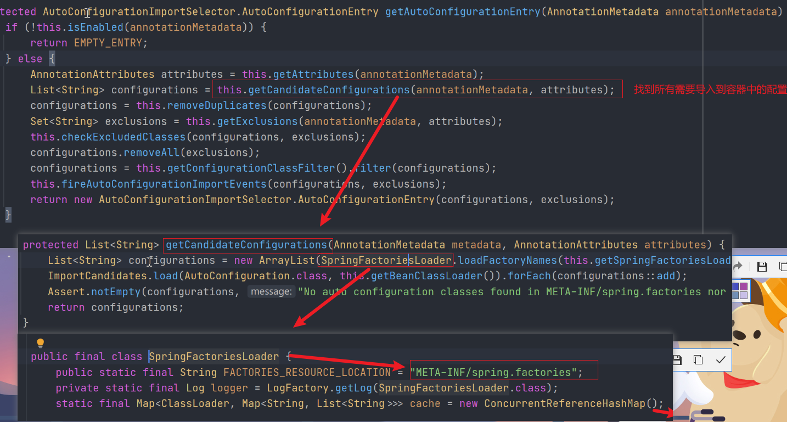
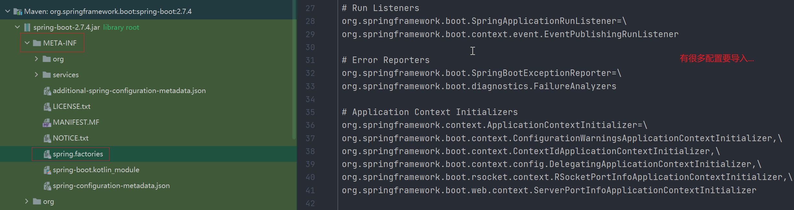
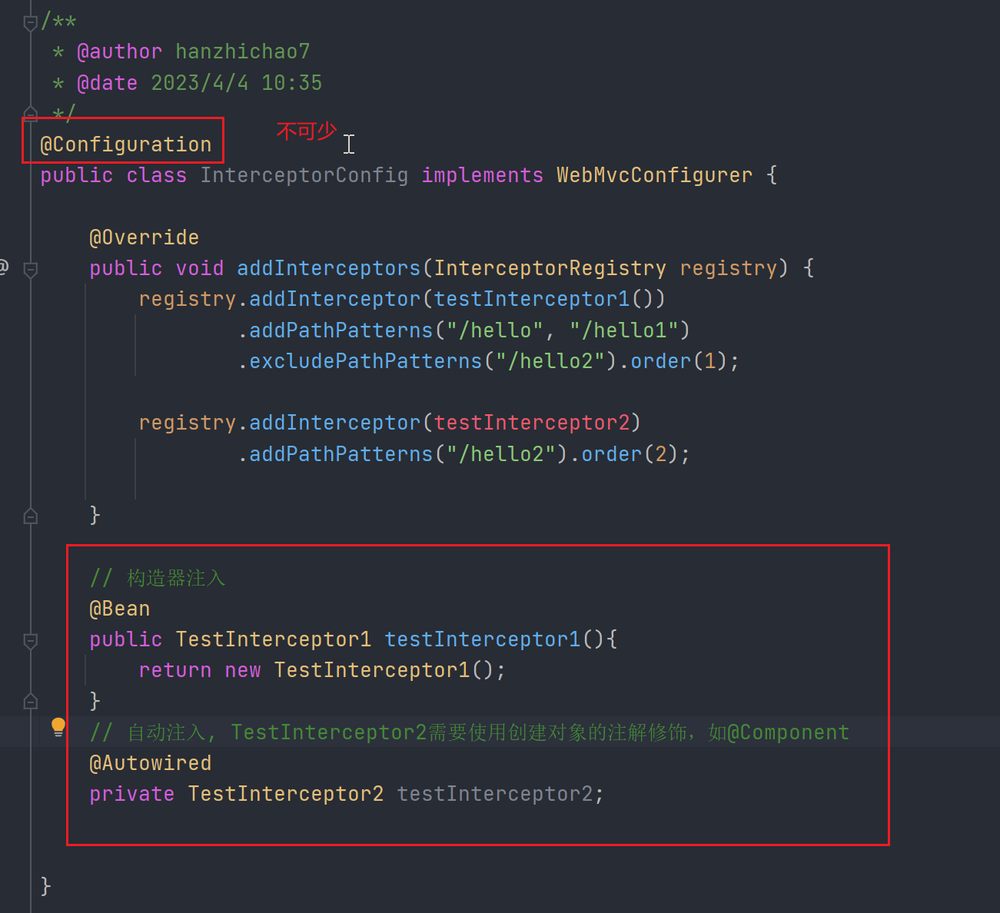
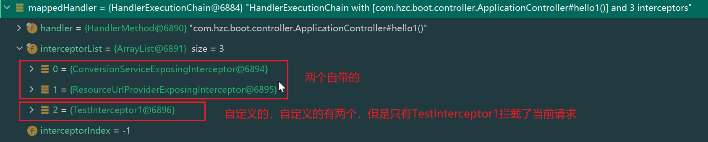

1. 导入启动类覆盖范围外的类
   - @SpringBootApplication 的scanBasePackages属性
   - 使用@ComponentScan注解
   - 使用@Import注解的basePackages属性，导入的是类的全称
   
2. @Configuration的 proxyBeanMethods属性(true/false)
   - true: Full模式，由spring进行代理，外部无论调用多少次该实例，都是从容器中取得单例对象；
   - false：Lite模式，每次调用都会新建该对象，不会容器中获取。

3. @Conditional, 按需加载注解, 作用在配置类上，需要与@Configuration 或者其它表示注解类的注解使用（@ConfigurationProperties + @Component）

4. @ImportResource: 导入原生配置文件, 在做项目改造等处可使用

5. 配置绑定：将配置文件与Bean对象绑定, 进行赋值等操作
   1. @ConfigurationProperties(prefix="配置名") 用来将配置文件与Java类进行绑定，但此时不会注入到IOC容器中
   2. 注入与配置绑定的Java类
      - @Component/@Configuration等创建Bean的注解
      - @EnableAutoConfigurationProperties : 将@ConfigurationProperties 注解标识的Java类装载到IOC容器中;
        1. 被@ConfigurationProperties标识的类不能加@Component等注解，否则容器中会存在两个相同的Bean，会报错；(NoUniqueBeanDefinitionException)
        2. @EnableAutoConfigurationProperties仅仅是将其装载到IOC中，如果在其它类中引入该类，需要对该类进行赋值，如结合@Autowired、@Resource等注解
6. @SpringBootApplication 注解，相当于@SpringBootConfiguration + @ComponentScan + @EnableAutoConfiguration
   1. @SpringBootConfiguration: 等于@Configuration注解，代表当前是一个配置类
   2. @ComponentScan: 包扫描注解，指定扫描路径
   3. @EnableAutoConfiguration: 
      - @AutoConfigurationPackage: 在AutoConfigurationPackages#registerBeanDefinitions断点调试发现，默认的包扫描路径就是主启动类所在的包
         1. 利用Register将指定目录下的所有组件导入到IOC中，
         2. 将扫描路径所在包下的所有组件导入进来
      - @Import({AutoConfigurationImportSelector.class}) AutoConfigurationImportSelector.class详解
         
        所以：默认扫描我们当前系统里面所有META-INF/spring.factories位置的文件
        即 spring-boot-autoconfigure-2.3.4.RELEASE.jar包里面的META-INF/spring.factories
        
        注：虽然这些配置类默认在启动的时候是全部加载，但是在实际加载时，会遵从@Conditional注解进行按需加载！
        
7. 定制化配置
    - 自己创建Bean对象替换底层的组件
    - 查看当前组件对应的配置文件，然后去修改对应的配置文件
       xxxAutoConfiguration ---> 组件  ---> 原Bean在xxxProperties里面拿值  ----> 在application.properties修改值
    - 解答：xxxAutoConfiguration 中导入了很多的组件，然后这些组件从 xxxProperties 中拿到对应的默认值，
        然后 xxxProperties 是从 application.properties 配置文件中获取的值，所以一般情况下我们只要改配置文件，就可以修改所有的默认行为。
       
8. yaml配置文件
    - 转义：双引号中的 "\n" 会换行， 而单引号中 '\n' 不会换行，原样输出\n
    
9. URL重写
    - 当Cookie禁用时，如果想要获取Session中的内容，就需要使用URL重写
    - 如何重写？将想使用的内容使用矩阵变量的方式进行传递即可，如：/index;session_example=xxx; /index是URL, 分号;后是矩阵变量，多个矩阵变量使用分号分隔
    - 接收方如何接收？使用@MatrixVariable注解，如 @MatrixVariable("session_example") String sessionExample
    - 注：矩阵变量的功能在SpringBoot中是默认禁用的，需要手动开启（涉及到了定制化SpringMVC，官方文档：自定义SpringMVC）

10. 路径变量
    - 示例： /api/{path} , {path}就是路径访问变量，path的实际值为前端访问时带入的值
    - 接收：可使用@PathVariable、@RequestParam 等注解接收

11. 自定义消息转换器 MessageConvert： 不同的请求返回不同格式的类型（如JSON格式、XML格式等）
    - 自定义转换器，实现HttpMessageConverter接口，重写相应的方法
    - 最暴力的方法：映射到不同的接口，每个接口返回所需的类型

12. 自定义WebMVC的一些功能
    定制MVC配置类WebConfig，实现WebMvcConfigurer接口，重写指定的方法即可
    
13. 自定义拦截器
    - 自定义拦截类：实现HandlerInterceptor接口，重写preHandle()，postHandle()，afterCompletion(),注意：只有preHandle()返回true，才会执行后续的方法
    - 注册拦截器：实现WebMvcConfigurer接口，重写addInterceptors(), 然后指定拦截路径，不拦截的路径，拦截器的顺序等（若存在多个拦截器，则指定拦截器的工作顺序）
    - 注意事项，需要将自定义拦截类注入到IOC中，如果使用自动注入，需要将先创建自定义拦截器类的对象，然后使用@Autowired
        
    
14. 拦截器的工作原理
    - 准备工作调试断点：DispatcherServlet#doDispatch()
    - 1.获取处理器执行链:mappedHandler = this.getHandler(processedRequest);
        
    - 2.通过处理器适配器找到处理当前请求的Handler, HandlerAdapter ha = this.getHandlerAdapter(mappedHandler.getHandler());
        遍历所有Handler，找到能处理当前请求的handler
    - 3.拦截器工作，if (!mappedHandler.applyPreHandle(processedRequest, response)) 
        `顺序`执行所有拦截器的preHandle方法，都返回true才进行下一步，如果当前拦截器返回false，则倒序执行已执行过拦截器的afterCompletion方法
    - 4.`倒序`执行所有拦截器的postHandle()方法：mappedHandler.applyPostHandle(processedRequest, response, mv);
    - 5.执行页面渲染：this.processDispatchResult(processedRequest, response, mappedHandler, mv, (Exception)dispatchException);
    - 注：3,4,5中返回false或者发生异常，都会`倒序触发`已经执行过拦截器的afterCompletion()
    
15. 异常解析器

16. Profile环境切换
    - pom文件配置
        <!-- 配置文件环境自动切换 -->
            <profiles>
                <profile>
                    <id>dev</id>
                    <properties>
                        <spring.profiles.active>dev</spring.profiles.active>
                    </properties>
                    <activation>
                        <!-- 指定默认环境 -->
                        <activeByDefault>true</activeByDefault>
                    </activation>
                </profile>
                <profile>
                    <id>uat</id>
                    <properties>
                        <spring.profiles.active>uat</spring.profiles.active>
                    </properties>
                </profile>
                <profile>
                    <id>pro</id>
                    <properties>
                        <spring.profiles.active>pro</spring.profiles.active>
                    </properties>
        
                </profile>
            </profiles>
    - yml文件配置
        - 书写对应环境的配置文件，如dev、uat、pre、pro
        - 动态获取当前环境profile对应id
            spring:
              profiles:
                active: @spring.profiles.active@
        - 指定每个配置文件的spring.config.activate.on-profile，示例如下
            spring:
              config:
                activate:
                  on-profile: dev
      
  

17. 配置文件的加载优先级

18. 自定义starter
